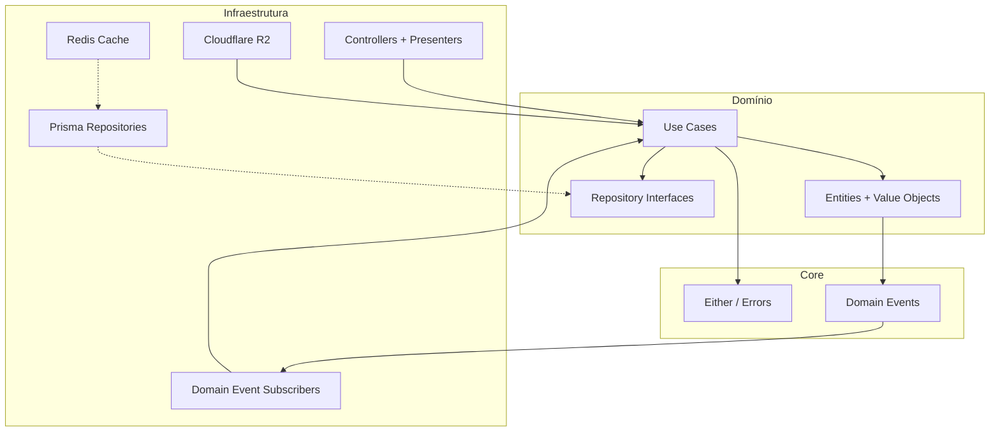

# Nest Clean

API REST de fórum Q&A construída com **NestJS** e **Clean Architecture** — perguntas, respostas, comentários, anexos, notificações em tempo real e cache com Redis.

---

## Destaques

- **Clean Architecture** com domínio isolado de frameworks e banco de dados
- **Domain Events** para notificações assíncronas (nova resposta, melhor resposta escolhida)
- **Cache Redis** com invalidação automática ao editar perguntas
- **Upload de anexos** integrado ao Cloudflare R2 (compatível com S3)
- **Autenticação JWT RS256** com chaves assimétricas
- **Testes unitários e E2E** com Vitest e schemas isolados por suite
- **Documentação interativa** com OpenAPI + [Scalar](https://scalar.com)

---

## Stack

| Camada | Tecnologias |
|---|---|
| Backend | NestJS 11, TypeScript |
| Banco | PostgreSQL, Prisma 7 |
| Cache | Redis, ioredis |
| Storage | Cloudflare R2 (AWS SDK) |
| Auth | Passport JWT, RS256 |
| Validação | Zod |
| Testes | Vitest, Supertest |
| Docs | OpenAPI, Scalar |
| Infra | Docker Compose |

---

## Arquitetura

O projeto separa **regras de negócio** da **infraestrutura**, facilitando testes, manutenção e troca de adapters (Prisma, Redis, R2) sem impactar o domínio.



### Estrutura de pastas

```
src/
├── core/                 # Either, AggregateRoot, DomainEvents, erros base
├── domain/
│   ├── forum/            # Perguntas, respostas, comentários, anexos
│   └── notification/     # Notificações + subscribers de eventos
├── infra/
│   ├── http/             # Controllers, pipes, presenters, Scalar
│   ├── database/         # Prisma, mappers, repositories
│   ├── cache/            # Redis
│   ├── storage/          # Upload R2
│   ├── events/           # Registro de subscribers NestJS
│   └── auth/             # JWT, guards, decorators
└── test/                 # Factories, repositórios in-memory, utils E2E
```

### Padrões aplicados

| Padrão | Onde |
|---|---|
| Repository | Abstração de persistência no domínio, implementação no Prisma |
| Use Case | Uma ação de negócio por classe (`CreateQuestion`, `AnswerQuestion`…) |
| Either | Retorno funcional de sucesso/erro sem exceções no domínio |
| Value Object | `Slug`, `QuestionDetails`, `CommentWithAuthor` |
| Domain Events | `AnswerCreated`, `QuestionBestAnswerChosen` → notificações |
| Presenter | Transformação entity → JSON na camada HTTP |
| Dependency Inversion | Domínio depende de abstrações, infra injeta implementações |

---

## Funcionalidades

### Fórum
- CRUD de perguntas e respostas
- Comentários em perguntas e respostas (com autor)
- Escolha da melhor resposta
- Upload de anexos (png, jpg, jpeg, pdf — máx. 2 MB)
- Detalhes da pergunta com autor, anexos e cache

### Notificações
- Disparadas por eventos de domínio
- Marcar como lida via API

### Autenticação
- Registro e login de alunos
- Rotas protegidas com Bearer JWT

---

## Documentação da API

Com o servidor rodando:

| URL | Descrição |
|---|---|
| [`/docs`](http://localhost:3333/docs) | Interface Scalar (testar rotas no browser) |
| [`/openapi.json`](http://localhost:3333/openapi.json) | Spec OpenAPI |

**Como autenticar no Scalar:**

1. `POST /accounts` — criar conta **ou** `POST /sessions` — login
2. Copiar o `access_token`
3. Clicar em **Authorize** → `Bearer <token>`

---

## Quick Start

### Pré-requisitos

- Node.js 20+
- Docker + Docker Compose
- Arquivos `.env` e `.env.test` configurados

### Instalação

```bash
git clone <seu-repo>
cd nest-clean

npm install
docker-compose up -d
npm run prisma:generate
npm run prisma:migrate
npm run start:dev
```

API disponível em `http://localhost:3333` · Docs em `http://localhost:3333/docs`

### Variáveis de ambiente

<details>
<summary>Clique para expandir</summary>

| Variável | Descrição |
|---|---|
| `DATABASE_URL` | Conexão PostgreSQL |
| `JWT_PRIVATE_KEY` | Chave privada JWT (base64) |
| `JWT_PUBLIC_KEY` | Chave pública JWT (base64) |
| `CLOUDFLARE_ACCOUNT_ID` | ID da conta Cloudflare |
| `CLOUDFLARE_PUBLIC_URL` | URL pública do bucket |
| `AWS_BUCKET_NAME` | Nome do bucket R2 |
| `AWS_ACCESS_KEY_ID` | Access key R2 |
| `AWS_SECRET_ACCESS_KEY` | Secret key R2 |
| `REDIS_HOST` | Host Redis (padrão: `127.0.0.1`) |
| `REDIS_PORT` | Porta Redis (padrão: `6379`) |
| `REDIS_DB` | Database Redis (padrão: `0`) |
| `PORT` | Porta da API (padrão: `3333`) |

</details>

---

## Endpoints

<details>
<summary><strong>Autenticação</strong> — rotas públicas</summary>

| Método | Rota | Descrição |
|---|---|---|
| `POST` | `/sessions` | Login → retorna JWT |
| `POST` | `/accounts` | Criar conta |

</details>

<details>
<summary><strong>Perguntas</strong></summary>

| Método | Rota | Descrição |
|---|---|---|
| `GET` | `/questions` | Listar recentes (`?page=1`) |
| `POST` | `/questions` | Criar pergunta |
| `GET` | `/questions/:slug` | Detalhes (cache Redis) |
| `PUT` | `/questions/:id` | Editar |
| `DELETE` | `/questions/:id` | Excluir |

</details>

<details>
<summary><strong>Respostas</strong></summary>

| Método | Rota | Descrição |
|---|---|---|
| `GET` | `/questions/:questionId/answers` | Listar |
| `POST` | `/questions/:questionId/answers` | Criar |
| `PUT` | `/answers/:id` | Editar |
| `DELETE` | `/answers/:id` | Excluir |
| `PATCH` | `/answers/:answerId/choose-as-best` | Melhor resposta |

</details>

<details>
<summary><strong>Comentários · Anexos · Notificações</strong></summary>

| Método | Rota | Descrição |
|---|---|---|
| `GET/POST` | `/questions/:id/comments` | Comentários da pergunta |
| `GET/POST` | `/answers/:id/comments` | Comentários da resposta |
| `DELETE` | `/questions/comments/:id` | Excluir comentário |
| `DELETE` | `/answers/comments/:id` | Excluir comentário |
| `POST` | `/attachments` | Upload multipart |
| `PATCH` | `/notifications/:id/read` | Marcar como lida |

</details>

> Detalhes completos, schemas e exemplos de request/response estão em [`/docs`](http://localhost:3333/docs).

---

## Testes

```bash
npm run test          # Unitários (use cases, entities)
npm run test:e2e      # E2E (controllers + eventos + cache)
npm run test:cov      # Cobertura
```

Os testes E2E usam **schema PostgreSQL isolado por suite** e **flush do Redis** entre execuções, garantindo independência entre testes.

---

## Scripts úteis

```bash
npm run start:dev       # Desenvolvimento com hot reload
npm run build           # Build de produção
npm run lint            # ESLint
npm run docker:up       # Postgres + Redis
npm run prisma:studio   # GUI do banco
```

---

## O que este projeto demonstra

- Organização de código em camadas com **baixo acoplamento**
- Testabilidade via repositórios in-memory e factories
- Integração com serviços externos (Postgres, Redis, R2) via adapters
- Eventos de domínio desacoplando side effects (notificações)
- Documentação de API profissional sem poluir o domínio
- Boas práticas NestJS: modules, guards, pipes, DI

---

## Licença

[MIT](LICENSE)
